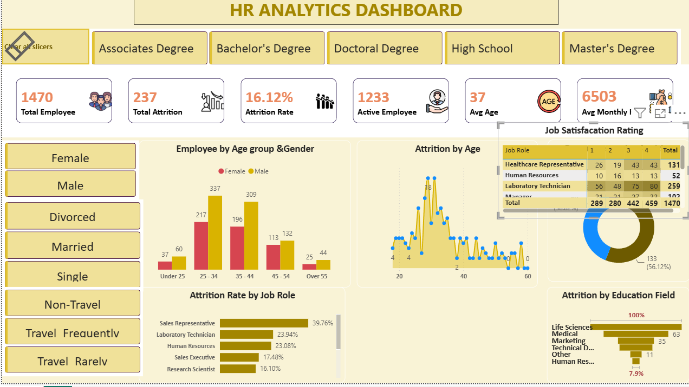

# HR Analytics Power BI Dashboard
## Project Overview
This project presents an interactive **HR Analytics Dashboard** developed using Microsoft Power BI. The dashboard analyzes employee workforce data to identify patterns related to employee attrition, demographics, job roles, education, salary, and job satisfaction.
The objective is to transform HR data into meaningful visual insights that can support workforce analysis and data-driven HR decision-making.
## Dashboard Highlights
The dashboard includes key HR metrics and interactive visualizations such as:
* Total Employees
* Total Attrition
* Attrition Rate
* Active Employees
* Average Employee Age
* Average Monthly Income
* Employee Distribution by Age Group and Gender
* Attrition by Age
* Job Satisfaction Rating by Job Role
* Attrition Rate by Job Role
* Attrition by Education Field
* Interactive slicers and filters
## Key Dashboard KPIs
* **Total Employees:** 1,470
* **Total Attrition:** 237
* **Attrition Rate:** 16.12%
* **Active Employees:** 1,233
* **Average Age:** 37
* **Average Monthly Income:** 6,503
## Tools & Technologies
* Microsoft Power BI
* Power Query
* DAX
* Microsoft Excel
* Data Visualization
* Data Cleaning & Transformation
* Interactive Dashboard Design
## Project Workflow
1. Imported HR employee data into Power BI.
2. Cleaned and transformed the data using Power Query.
3. Created calculated measures using DAX.
4. Analyzed employee demographics and attrition.
5. Created interactive charts, KPI cards, slicers, and filters.
6. Designed an interactive HR Analytics Dashboard.
7. Generated insights to support HR decision-making.
## Business Insights
The dashboard helps identify:
* Overall employee attrition levels.
* Employee distribution across different age groups and genders.
* Attrition patterns across age groups.
* Job roles with comparatively higher attrition rates.
* Relationship between education fields and attrition.
* Job satisfaction levels across different job roles.
* Workforce characteristics based on salary and demographics.
## Dashboard Preview

## Project Files
* `Dashboard/` – Power BI dashboard file.
* `Dataset/` – Source HR dataset, if permitted to share.
* `Screenshots/` – Dashboard preview image.
* `Documentation/` – Additional project documentation.
## Conclusion
This project demonstrates practical skills in **data cleaning, data analysis, DAX, Power BI dashboard development, data visualization, and business insight generation**. It showcases how HR data can be converted into an interactive dashboard for workforce and attrition analysis.
